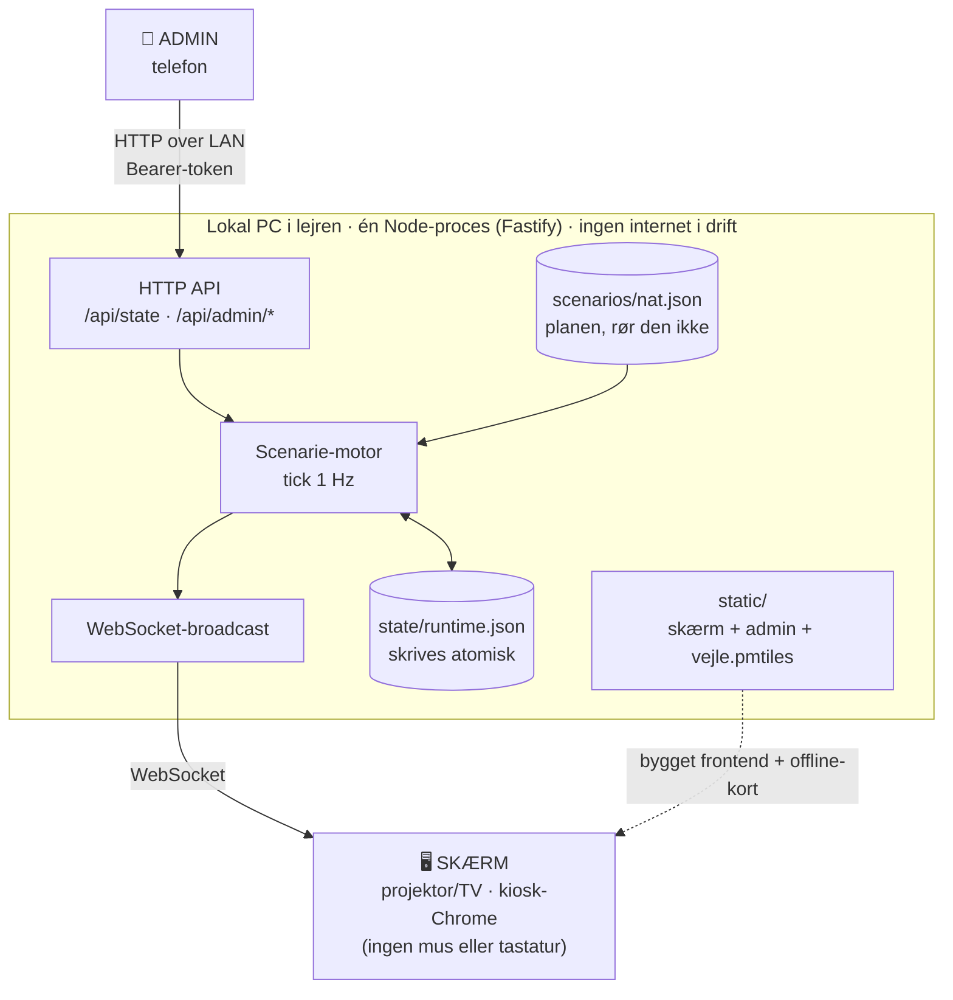

# VASE NATVAGT — Emergency Monitor

Overvågningsmonitor til nataktiviteten på Seniorkursus Vork E26.

Deltagerne (VASE-dedektiverne) sidder vagt foran en skærm gennem natten. Skærmen
viser et levende overvågningsbillede af området omkring FDF Lejrcenter Vork.
På et tidspunkt, som **kun ADMIN kender**, udløses en alarm, og et punkt bliver
synligt på kortet. Vagtholdet skal derefter hurtigst muligt rykke ud mod punktet.

Deltagerne har **hverken mus eller tastatur**. Skærmen skal derfor køre helt
autonomt hele natten uden menneskelig indgriben.

## Systemet



Skærmen kører på `localhost` og er upåvirket af netværket. Falder wifi ud, kører
natten videre efter planen — kun admin-styringen holder op med at virke.

## Dokumenter

| Fil | Indhold |
|---|---|
| [docs/01-koncept.md](docs/01-koncept.md) | Fiktion, æstetik, dramaturgi og oplevelsesdesign |
| [docs/02-spec.md](docs/02-spec.md) | Teknisk specifikation, arkitektur, datamodel og API |
| [docs/03-todos.md](docs/03-todos.md) | Opgavenedbrydning i faser med acceptkriterier |
| [docs/04-skills.md](docs/04-skills.md) | Researchede agent-skills koblet til hver fase |

## Grundfakta

- **Base / kortets midtpunkt:** FDF Lejrcenter Vork, Vork Bakker 12, 7100 Vejle
- **Koordinat:** `55.65831, 9.359385` (WGS84, slået op via OpenStreetMap Nominatim — **skal verificeres i marken**)
- **Drift:** offline-first på lokal PC. Skal fungere selv hvis wifi falder ud kl. 02.
- **Målgruppe:** 15-18 år

## Kom i gang

```bash
npm install
npm test          # 143 tests, 96 % dækning
npm run dev       # server paa http://localhost:8477
```

I udvikling genererer serveren selv et flygtigt admin-token og skriver det i
opstartsloggen. I drift kræves et rigtigt token — se `.env.eksempel`:

```bash
npm run token     # generer et admin-token
```

### Afspil hele natten på få minutter

Uret er injicerbart, så generalprøven bruger samme kode som den rigtige nat:

```bash
NATVAGT_SCENARIE=scenarios/generalprove.json NATVAGT_HASTIGHED=60 NATVAGT_VIRTUEL_START=2026-07-15T23:30:00+02:00 npm start
```

## Prøv det af nu

`scenarios/nat.json` er dateret til den rigtige nat i juli. Kører du den på en
anden dato, ligger alle tidspunkter i fortiden, motoren indhenter dem på første
tick, og du står med en skærm i fasen `AFSLUTTET` og ingen alarm at fyre.

```bash
npm run i-aften          # vagten begynder næste gang klokken er 23.30
npm run i-aften -- +5    # vagten begynder om 5 minutter
npm run i-aften -- +2 60 # ... og natten kører 60 gange for hurtigt
```

Scriptet skriver en forskudt kopi, rydder den gemte nat og starter serveren.
Planen røres ikke.

## Styring fra telefonen

```bash
npm run token       # generér et admin-token
npm run adminlink   # find maskinens IP og få linket med token
```

Læg tokenet i `.env` i projektets rod — serveren læser filen ved opstart:

```
NATVAGT_MILJOE=drift
NATVAGT_ADMIN_TOKEN=<dit token>
NATVAGT_PORT=8477
```

Uden `.env` starter serveren i udviklingstilstand og genererer selv et flygtigt
token, som skrives i opstartsloggen. Det skifter ved hver genstart, så et fast
token i `.env` er det, der gør et printet link eller en QR-kode holdbar.

Rigtige miljøvariabler vinder over filen, så `NATVAGT_HASTIGHED=60 npm start`
virker stadig.

Åbn linket på telefonen. Alt der ikke kan fortrydes — fyr, stop, aflys — kræver
at knappen holdes inde i 2 sekunder.

**Alt andet passer sig selv.** Anomalier og dekryptering genereres af uret og
står hverken i scenariefilen eller i admin. De sker tilfældigt inden for
nattevinduet — og aldrig mens en alarm kører.

**Sæt nattens alarm** i panelet øverst: tidspunkt og koordinat. Feltet regner
afstand, pejling og sektor ud mens du taster, så et taste-slip fanges med det
samme.

Er alarmen brugt, skifter panelet til **"Opret en alarm"** — så I kan sætte en
ny uden at genstarte noget.

**Forstyrrelser** sætter monitoren ud af drift, mens I ser på. Tre kontakter:
*slør kortet* gør terrænet ulæseligt, men lader ringe, sektorer og alarmpunkt
være skarpe; *skjul koordinatet* lader det flakke ud, mens afstand og pejling
bliver stående; *glitch* får skærmen til at sætte ud en gang imellem og komme
tilbage. De kan altid slås fra igen, så de kræver ikke langt tryk. Ændringerne gemmes i `state/scenarie.json`; `scenarios/nat.json` er
planen og røres aldrig. `npm run adminlink` og et tryk på "nulstil" bringer alt
tilbage til planen.

Virker linket ikke, er det næsten altid Windows Firewall. Bemærk at **skærmen
selv kører på localhost** og er upåvirket af netværket: falder nettet væk, kører
natten videre på den planlagte tidsplan. Kun styringen holder op med at virke.

## Status

| Fase | Status |
|---|---|
| 0 — Beslutninger og rekognoscering | **Åben** — blokerer fase 8 og fase 7's soak-test |
| 1 — Skelet | Færdig |
| 2 — Scenarie-motoren | Færdig |
| 3 — Offline-kortet | Færdig |
| 4 — Panelerne | Færdig |
| 5 — Alarmtilstanden | Færdig |
| 6 — Admin | Færdig |
| 7 — Robusthed, kiosk, soak-test | Ikke påbegyndt |
| 8 — Indhold og fiktion | Blokeret af fase 0 |
| 9 — Generalprøve | Ikke påbegyndt |

Hele kæden er afprøvet ende til ende i browseren: et langt tryk på telefonen
fyrer alarmen, og skærmen viser den med afstand, pejling og koordinat.

## Sammenhæng med det øvrige VASE-materiale

Optagelsesprøven om søndagen (`../Optagelsesprøven/`) slutter med en lukket kuvert:
*»EGTVED – ARKIVMATERIALE. Til nyoptaget personel. Afventer nattens briefing.«*
Drejebogen gemmer eksplicit **kultens navn, overtroen og kortets første halvdel**
til nattens papirarbejde. Monitoren er den kanal, der leverer den anden halvdel.

## Start natvagten (kør non-stop)

Dobbeltklik på **`start.bat`** (eller `npm run natvagt`). Scriptet:

- holder PC'en vågen (ingen dvale/slukket skærm på lysnettet),
- bygger skærm og admin, hvis det mangler,
- åbner skærmen i fuldskærm (Chrome/Edge kiosk),
- **genstarter serveren automatisk, hvis den dør** — nattens tilstand ligger på disk og genoptages.

```
start.bat -Autostart        # start selv ved hver Windows-login
start.bat -FjernAutostart   # fortryd
start.bat -UdenBrowser      # kun serveren
```

Kortet dækker nu en radius på **3000 m** (`kort.maxRadiusM` i `scenarios/nat.json`,
start-zoom 13). Kortfilen rækker 4500 m fra basen; ønskes mere, hæv radius og kør
`npm run hent-kort -- --margin 7000`.

`start.bat` skriver også **admin-linket** ud, kopierer det til udklipsholderen og gemmer det
i `admin-link.txt` (skærmen i fuldskærm dækker vinduet). Linket indeholder tokenet og bliver ikke
committet. Skifter netværk (fx på Vork), får du det rigtige link ved næste start.
